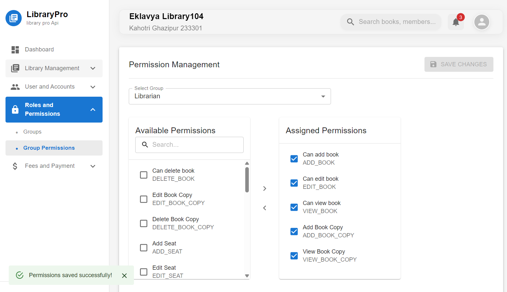

# Library Management ERP - Frontend

Welcome to the frontend of the Library Management ERP Solution! This project is a modern, responsive, and feature-rich user interface built with React and Vite. It leverages Material-UI for a clean design, Redux for robust state management, and JWT for secure authentication.

You can see here [Library Management ERP Solution](https://library-management-erp-solution.onrender.com)

## Tech Stack

- Framework: React
- Build Tool: Vite
- UI Library: Material-UI (MUI)
- State Management: Redux Toolkit
- Authentication: JSON Web Tokens (JWT)
- Routing: React Router
- API Calls: Axios , React-Query, Formik, Yup

## Output Screenshots

### Login Screen


### Dashboard



## Geting Started

```bash
# Clone the repository
git clone https://github.com/rahulkbharti/library_system_v2_frontend.git
# Goes in directory
cd library_system_v2_frontend
# installl
npm i
# Run the development server
npm run dev
```
